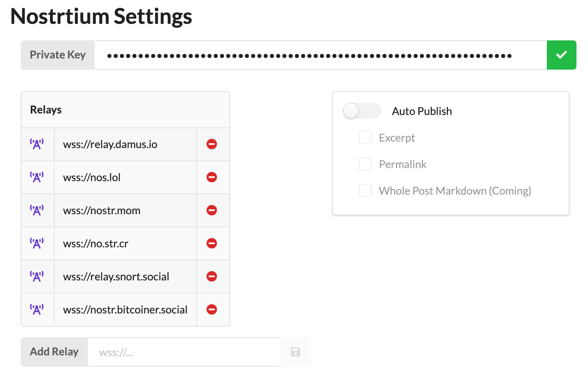

# wp-nostr
_Post to Nostr from WordPress_

This is a beta quality first-pass at a plugin that lets you post from WordPress to Nostr.

This initial version just implements basic nostr settings (private key, relays) and provides a metabox in the WordPress Post editing page which is pre-populated with the Post Excerpt and a link to the Post and lets you post the content of that metabox to your configured relays.

This creates a twitter-style "announcement" note on nostr. A lot of nostr clients will render the link to the WordPress post as a nice-looking summary card with featured image and etc. This functionality is probably enough for many use-cases but I have plans to add a lot more to this plugin in the future, including generation of keys; support for NIP-07 browser extensions; as well as support for full, long-form content from WP to Nostr.

Please test and report issues here.

[Note that the private key is stored encrypted in the WordPress database using libsodium cryptography.]

## Requirements
Some of the included libraries have relatively recent dependency requirements so you will need the following in your WordPress platform:
* PHP 8.1+
* php-gmp module must be installed ([Installation on Ubuntu](https://computingforgeeks.com/how-to-install-php-on-ubuntu-linux-system/))
* WordPress 6.0+
* Writable installation directory (on activation, the plugin writes a cryptographic keyfile to its own install directory)

## Installation
If you want to use the plugin, download the latest zip release from the [releases page](https://github.com/pjv/wp-nostr/releases).

This repository does not include the required vendor directory, so you cannot just clone this repo and use it as-is. If you want to code on it, you can clone it and do `composer install`.

## How to Use
1. After installing and activating the plugin, go into Settings -> WP Nostr and copy/paste the private key (nsec1...) that you want to post from and tweak the relays to your liking.



2. Then visit the post editor page for an existing post and at or near the bottom you should see the WP Nostr metabox which is pre-populated with the excerpt and permalink for the post:


### User Role / Capability Filter
You can create a filter snippet (in functions.php) to choose what user role or capability has access to WP Nostr functionality. The default is `edit_posts`. Here is a sample snippet that would change it so only adminstrators can see / use the plugin's functionality:

````
add_filter ('wpnostr_role', function($role){
	return 'administrator';
});
````

## Support
Want to support development of WP Nostr? Here's a bitcoin address to send to:

bc1qlwrw8n9hf87zuvgq2xzucudcjv2mc4v7pg256g

## TODO
* Separate private keys for individual WP users
* Generate keys on the settings page and/or user profile page
* NIP-07 signing
* Long-form Nostr posting
* Automated Nostr posting on WP publish
* Relay sets
* Nostr profile editing